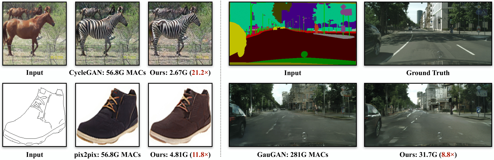
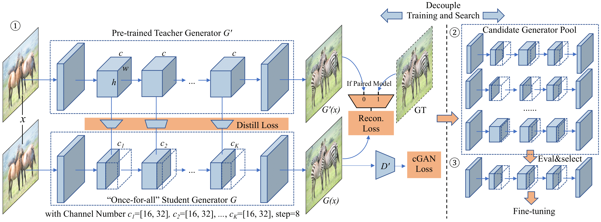

# GAN Compression
### [paper](https://arxiv.org/abs/2003.08936) | [demo](https://tinyurl.com/r474uca)


**[NEW!]** The PyTorch implementation of a general conditional GAN Compression framework is released.  



GAN Compression: Efficient Architectures for Interactive Conditional GANs<br>
 [Muyang Li](https://lmxyy.me/), [Ji Lin](http://linji.me/), [Yaoyao Ding](https://yaoyaoding.com/), [Zhijian Liu](http://zhijianliu.com/), [Jun-Yan Zhu](https://people.csail.mit.edu/junyanz/), and [Song Han](https://songhan.mit.edu/)<br>
 MIT, Adobe Research, SJTU<br>
 In CVPR 2020.  

## Demos

<br>

<br><br><br><br><br><br><br><br><br><br><br><br><br><br><br><br>

## Overview



## Colab Notebook

PyTorch Colab notebook: [CycleGAN](https://colab.research.google.com/github/mit-han-lab/gan-compression/blob/master/cycle_gan.ipynb) and [pix2pix](https://colab.research.google.com/github/mit-han-lab/gan-compression/blob/master/pix2pix.ipynb).

## Prerequisites

* Linux
* Python 3
* CPU or NVIDIA GPU + CUDA CuDNN

## Getting Started

### Installation

- Clone this repo:

  ```shell
  git clone git@github.com:mit-han-lab/gan-compression.git
  cd gan-compression
  ```

- Install [PyTorch](https://pytorch.org) 1.4 and other dependencies (e.g., torchvision).

  - For pip users, please type the command `pip install -r requirements.txt`.
  - For Conda users, we provide an installation script `./scripts/conda_deps.sh`. Alternatively, you can create a new Conda environment using `conda env create -f environment.yml`.

- Install [torchprofile](https://github.com/mit-han-lab/torchprofile).

  ```shell
  pip install --upgrade git+https://github.com/mit-han-lab/torchprofile.git
  ```

### CycleGAN

#### Setup

* Download the CycleGAN dataset (e.g., horse2zebra).

  ```shell
  bash datasets/download_cyclegan_dataset.sh horse2zebra
  ```

* Get the statistical information for the ground-truth images for your dataset to compute FID. We provide pre-prepared real statistic information for several datasets. For example,

  ```shell
  bash ./datasets/download_real_stat.sh horse2zebra A
  bash ./datasets/download_real_stat.sh horse2zebra B
  ```

  You could also calculate the real statistical information yourself via `get_real_stat.py`. For example,

  ```shell
  python get_real_stat.py --dataset_mode single \
  --data_path database/horse2zebra/valA \
  --output_path real_stat/horse2zebra_A.npz
  ```

#### Apply a Pre-trained Model

* Download the pre-trained models.

  ```shell
  python scripts/download_model.py --model pix2pix --task edges2shoes-r --stage full
  python scripts/download_model.py --model pix2pix --task edges2shoes-r --stage compressed
  ```

* Test the original full model.

  ```shell
  bash scripts/cycle_gan/horse2zebra/test_full.sh
  ```

* Test the compressed model.

  ```shell
  bash scripts/cycle_gan/horse2zebra/test_compressed.sh
  ```

### Pix2pix

#### Setup

* Download the pix2pix dataset (e.g., edges2shoes).

  ```shell
  bash ./datasets/download_pix2pix_dataset.sh edges2shoes-r
  ```

* Get the statistical information for the ground-truth images for your dataset to compute FID. We provide pre-prepared real statistics for several datasets. For example,

  ```shell
  bash datasets/download_real_stat.sh edges2shoes-r B
  ```

  You could also calculate the real statistics yourself via `get_real_stat.py`. For example,

  ```shell
  python get_real_stat.py \
  --dataroot database/edges2shoes-r \
  --output_path real_stat/edges2shoes-r_B.npz \
  --direction AtoB
  ```

#### Apply a Pre-trained Model

* Download the pre-trained models.

  ```shell
  python scripts/download_model.py --model pix2pix --task edges2shoes-r --stage full
  python scripts/download_model.py --model pix2pix --task edges2shoes-r --stage compressed
  ```

* Test the original full model.

  ```shell
  bash scripts/pix2pix/edges2shoes-r/test_full.sh
  ```

* Test the compressed model.

  ```shell
  bash scripts/pix2pix/edges2shoes-r/test_compressed.sh
  ```

#### Cityscapes Dataset

For the Cityscapes dataset, we cannot provide it due to license issue. Please download the dataset from https://cityscapes-dataset.com and use the script `datasets/prepare_cityscapes_dataset.py` to preprocess it. You need download `gtFine_trainvaltest.zip` and `leftImg8bit_trainvaltest.zip` and unzip them in the same folder. For example, you may put `gtFine` and `leftImg8bit` in `database/cityscapes-origin`. You could prepare the dataset with the following command:

```shell
python datasets/prepare_cityscapes_dataset.py \
--gtFine_dir database/cityscapes-origin/gtFine \
--leftImg8bit_dir database/cityscapes-origin/leftImg8bit \
--output_dir database/cityscapes \
--table_path ./dataset/table.txt
```

You will get a preprocessed dataset in `database/cityscapes` and a mapping table (used to compute mAP) in `dataset/table.txt`.

## Citation

If you use this code for your research, please cite our [paper](https://arxiv.org/pdf/2003.08936).
```
@inproceedings{li2020gan,
  title={GAN Compression: Learning Efficient Architectures for Conditional GANs},
  author={Li, Muyang and Lin, Ji and Ding, Yaoyao and Liu, Zhijian and Zhu, Jun-Yan and Han, Song},
  booktitle={Proceedings of the IEEE/CVF Conference on Computer Vision and Pattern Recognition},
  year={2020}
}
```


## Acknowledgements

Our code is developed based on [pytorch-CycleGAN-and-pix2pix](https://github.com/junyanz/pytorch-CycleGAN-and-pix2pix) and [SPADE](https://github.com/NVlabs/SPADE).

We also thank [pytorch-fid](https://github.com/mseitzer/pytorch-fid) for FID computation and [drn](https://github.com/fyu/drn) for mAP computation.
